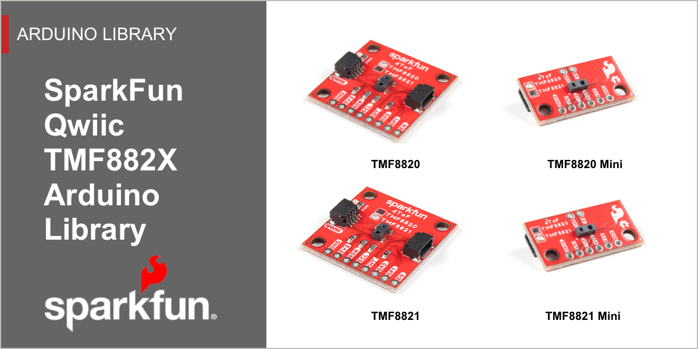

# The Qwiic TMF882X Arduino Library

The SparkFun Qwiic TMF882X Arduino Library is a single module that supports all SparkFun TMF882X boards based on the TMF882X Time of Flight sensors from AMS. 

### Key Features
* Implemented using the AMS provided TMF882X SDK.
* Uses a callback function design pattern to efficiently deliver the data results from the connected TMF882X device. 
* Supports factor calibration of the sensor. 
* Enables rapid use of the built in SPAD Map functionality of the device, as well as defining custom SPAD Maps to meet desired needs. 
* Supports data collection based on data counts, timeout value or until a stop command is issues.

### Getting Started

The [Getting Started Page](software.md) outlines library installation and the general use of the Qwiic TMF882X library. 

Detailed examples are included as part of the library installation process and available in the Arduino IDE `File > Examples >` menu. 

A full [API Reference](api_device.md) is also provided for the library.

### Supported Products

The SparkFun Qwiic TMF882X Arduino Library supports the following SparFun Products

<table class="table table-hover table-striped table-bordered">
    <tr>
        <td width="120" pad=10 style="vertical-align: middle;">
            </td>
         <td style="text-align:left; vertical-align: middle; padding-left: 20px;font-weight: bold;">
            <a href="https://www.sparkfun.com/products/19036">SparkFun Qwiic dToF Imager TMF8820</a>
        </td>
    </tr>
    <tr>
        <td width="120" pad=10 style="vertical-align: middle;">
            </td>
         <td style="text-align:left; vertical-align: middle; padding-left: 20px;font-weight: bold;">
           <a href="https://www.sparkfun.com/products/19036">SparkFun Qwiic Mini dToF Imager TMF8820)</a>
        </td>
    </tr>
    <tr>
        <td width="120" pad=10 style="vertical-align: middle;">
            </td>
         <td style="text-align:left; vertical-align: middle; padding-left: 20px;font-weight: bold;">
           <a href="https://www.sparkfun.com/products/19037">SparkFun Qwiic dToF Imager TMF8821</a>
        </td>
    </tr>
    <tr>
        <td width="120" pad=10 style="vertical-align: middle;">
            </td>
         <td style="text-align:left; vertical-align: middle; padding-left: 20px;font-weight: bold;">
           <a href="https://www.sparkfun.com/products/19037">SparkFun Qwiic Mini dToF Imager TMF8821</a>
        </td>
    </tr>
</table>

### Supported Microcontrollers - Arduino Environment

* [Artemis](https://www.sparkfun.com/products/15574)
* [SAMD51](https://www.sparkfun.com/products/14713)
* [ESP32](https://www.sparkfun.com/products/15663)
* [STM32](https://www.sparkfun.com/products/17712)
* [SAMD21](https://www.sparkfun.com/products/14812)
* [nrf5280](https://www.sparkfun.com/products/15025)
* [Teensy](https://www.sparkfun.com/products/16402)

### License
The SparkFun Qwiic TMF882X Arduino Library is licensed using the Open Source MIT License